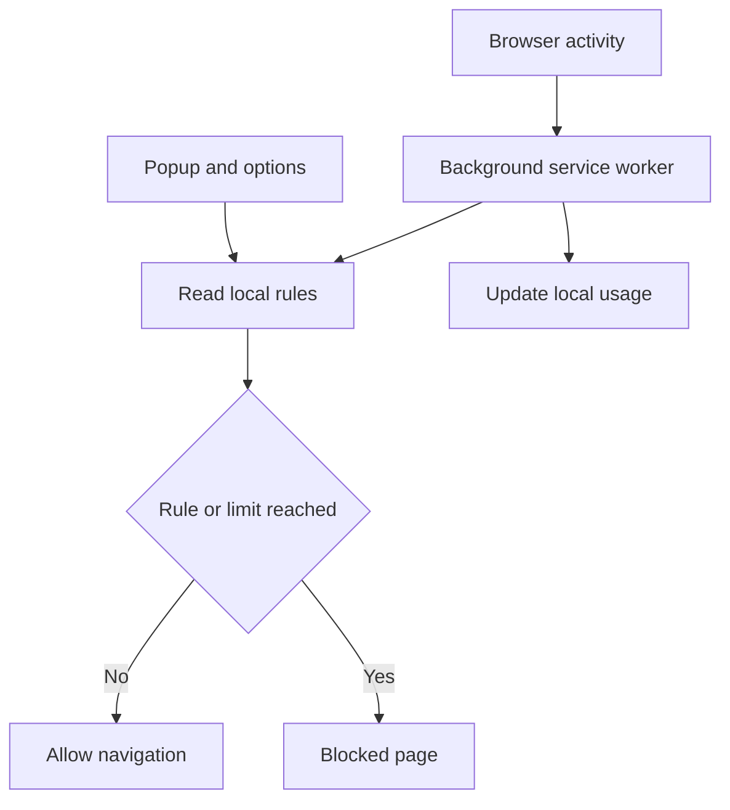

# Aegis Cognition

A Manifest V3 Chrome extension for experimenting with local website rules and browser-usage limits.

The extension tracks time spent on configured websites, applies daily limits, blocks specified domains or keywords, and provides a local override workflow. Configuration is stored with the Chrome Storage API.

> **Project scope:** This is a browser-extension prototype, not a tamper-resistant parental-control product. A user with access to Chrome settings, extension files, developer tools, or the browser profile may disable or bypass its controls.

## Motivation

Browser distractions are often addressed with simple blocklists, but time-based rules require additional state: active tabs, elapsed time, daily resets, configuration changes, and override behavior.

I built this project to learn how those concerns can be coordinated in a Chrome extension. The project explores:

- Tracking browsing time with a background service worker.
- Persisting preferences with Chrome's extension storage.
- Matching requested pages against local domain and keyword rules.
- Redirecting blocked navigation to an explanation page.
- Managing configuration through popup and options interfaces.
- Working within the lifecycle constraints of Manifest V3.

## Implemented Functionality

- Per-site browser-usage tracking
- Configurable daily time limits
- Domain-based blocking rules
- Keyword-based URL filtering
- Redirect to a local blocked page
- Local override workflow
- Optional restrictive browsing mode
- Popup status and controls
- Options page for configuration
- Local settings through the Chrome Storage API

Keyword and domain rules are deterministic string-matching controls. They are not machine-learning content classification and should not be described as reliable detection of every unsafe or adult page.

## How It Works



The general flow is:

1. The background worker observes supported browser activity.
2. It reads the configured domains, keywords, and time limits.
3. It updates locally stored usage state.
4. Matching navigation is redirected to `blocked.html`.
5. The blocked page explains the active rule and exposes the implemented override path.
6. The popup and options page allow configuration to be viewed or changed.

## Project Structure

```text
AEGIS_COGNITION-Parental_Control/
├── icon/
├── manifest.json
├── background.js
├── filter.js
├── popup.html
├── popup.js
├── options.html
├── options.js
├── blocked.html
├── blocked.js
└── README.md
```

| File | Purpose |
| --- | --- |
| `manifest.json` | Declares extension metadata, permissions, and entry points |
| `background.js` | Coordinates activity tracking and background state |
| `filter.js` | Applies configured domain and keyword rules |
| `popup.*` | Provides quick status and controls |
| `options.*` | Provides persistent configuration controls |
| `blocked.*` | Displays the blocked-navigation view and override workflow |
| `icon/` | Contains extension icons |

## Technology

| Area | Technology |
| --- | --- |
| Extension platform | Chrome Extension Manifest V3 |
| Logic | JavaScript |
| Interface | HTML, CSS |
| Background processing | Extension service worker |
| Persistence | Chrome Storage API |

No backend is required for the documented local workflow.

## Installation

Clone the repository:

```bash
git clone https://github.com/dhyanagni2001-commits/AEGIS_COGNITION-Parental_Control.git
cd AEGIS_COGNITION-Parental_Control
```

Load it as an unpacked extension:

1. Open `chrome://extensions/`.
2. Enable **Developer mode**.
3. Select **Load unpacked**.
4. Choose the repository root.
5. Pin the extension if you want quick access to its popup.

After changing source files, reload the extension from `chrome://extensions/` before testing again.

## Usage

1. Open the extension popup or options page.
2. Configure the daily limit supported by the current implementation.
3. Add domains that should be blocked.
4. Add URL keywords when broader string-based rules are needed.
5. Browse normally and inspect the displayed usage state.
6. Confirm that a matching rule redirects to the local blocked page.
7. Test the override behavior and daily reset logic.

Use test domains and a separate browser profile while developing blocking behavior so an incorrect rule does not disrupt normal browsing.

## Rule Behavior

### Domain Rules

Domain rules are more predictable than general keyword rules, but matching must account for:

- Subdomains
- Mixed letter case
- Trailing dots
- Similar-looking domains
- URLs containing a blocked domain only as a query value
- Internationalized domain names

Rules should compare parsed hostnames rather than searching the complete URL as an unstructured string.

### Keyword Rules

Keyword matching is lightweight and easy to explain. It can block harmless pages containing the same word, miss synonyms or obfuscated terms, and behave differently across languages.

The UI should describe keyword matching as a configurable browsing rule, not as proof that a page is safe or unsafe.

### Time Limits

Accurate usage measurement requires a clear definition of active time. The implementation should specify whether time is counted when:

- A tab is active but the Chrome window is unfocused
- The device is idle or locked
- Audio continues from a background tab
- Multiple matching tabs are open
- The service worker is suspended and later restarted

Daily-reset behavior should also define the timezone and how sleep or clock changes are handled.

## Local Storage and Privacy

The documented design stores configuration and usage state through Chrome's extension storage rather than a project-operated server.

That does not automatically mean that no data can leave the device. A local-only claim should be supported by reviewing the current source code and confirming that:

- No analytics or telemetry SDK is included.
- No `fetch`, WebSocket, beacon, or external form submission sends browsing data.
- Extension permissions are limited to implemented functionality.
- Content Security Policy does not allow unnecessary remote code.
- Settings are not synchronized through `chrome.storage.sync` unless that behavior is disclosed.
- Error reporting does not transmit URLs or browsing history.

Chrome's own browser and account behavior is outside this project's control.

## Password and Override Model

A password prompt can prevent accidental changes through the normal interface, but it does not create a strong security boundary when verification and storage are entirely client-side.

Important limitations include:

- Extension storage can be inspected or modified by a user controlling the browser profile.
- The extension can be disabled or removed from Chrome settings.
- Unpacked extension source can be edited.
- Client-side hashes can be copied or replaced.
- Browser reset or a new profile can bypass the configuration.

Do not store a plaintext password. If a password is retained, use a salted, deliberately slow derivation function and document that it protects against casual disclosure rather than a device administrator.

## Permissions

Every permission in `manifest.json` should be documented with the feature that requires it.

| Permission category | Reason to review |
| --- | --- |
| Tab or activity access | May expose visited URLs and active-tab information |
| Storage | Persists rules, usage state, and override configuration |
| Navigation controls | Enables matching or redirecting requested pages |
| Host access | Determines which websites the extension can inspect or affect |

Use the narrowest host and API permissions that support the implemented features.

## Testing Strategy

The repository does not currently document automated test coverage. Useful tests include:

- Domain normalization and exact-host matching
- Subdomain policy
- Keyword case and boundary handling
- Duplicate and invalid rule inputs
- Time accumulation across tab changes
- Window focus and idle-state transitions
- Service-worker suspension and restart
- Daily reset at a deterministic time
- Concurrent updates to storage
- Correct blocked-page reason
- Override success, failure, and expiration
- Upgrade and configuration-migration behavior

Chrome extension APIs can be wrapped behind small interfaces so core rule and timing logic can be unit-tested without launching the browser. Browser-level tests can then verify permissions, redirects, and persistence.

## Design Tradeoffs

### Local-Only Architecture

Avoiding a project backend reduces operational complexity and limits external data transfer. It prevents centralized management, cross-device policy enforcement, remote recovery, and server-side auditing.

### Manifest V3 Service Worker

A service worker fits Chrome's current extension model and does not run continuously. Its suspension behavior requires important state to be persisted and timing logic to tolerate restarts.

### Rule-Based Filtering

Domain and keyword rules are transparent and inexpensive. They require manual maintenance and cannot understand page meaning, images, context, or intent.

### Client-Side Override

A local override works without a server or account. It is appropriate for self-management or casual friction but cannot resist a user who controls the browser.

### Browser-Level Controls

An extension can affect activity inside the browser where it is installed. It cannot govern other browsers, applications, private profiles, or the operating system.

## Safety and Responsible Use

Usage tracking can become invasive when applied without the browser user's knowledge. The extension should be used transparently and with age-appropriate consent.

- Explain what activity is measured.
- Provide access to the stored data and current rules.
- Provide a way to reset or delete stored data.
- Avoid collecting complete browsing history when aggregate duration is sufficient.
- Do not present filtering as a guarantee of child safety.
- Use platform-level family-safety tools when tamper resistance is required.

## Known Limitations

- A user with control of Chrome can disable or bypass the extension.
- Rule-based filtering cannot reliably classify page content.
- Controls apply only to supported activity in the installed browser profile.
- Service-worker suspension can complicate precise time tracking.
- Local storage is not a secure credential vault.
- Incognito behavior depends on browser configuration and permissions.
- No remote administration or cross-device synchronization is documented.
- Automated tests and continuous integration are not documented.
- Accessibility and usability testing are not documented.

## Possible Improvements

- Separate pure rule evaluation from Chrome API interactions.
- Add unit tests for URL matching and time accounting.
- Add browser-level tests for redirects and storage persistence.
- Add explicit idle and window-focus handling.
- Add schema versions and migrations for stored configuration.
- Add a clear-data and configuration-export workflow.
- Add accessible labels, keyboard navigation, and visible focus states.
- Document every requested extension permission.
- Add a transparent activity summary without storing full browsing history.
- Add GitHub Actions checks for syntax, linting, and tests.

## What I Learned

This project helped me work with Manifest V3, background service-worker lifecycle, browser events, local extension storage, navigation rules, and configuration interfaces.

It also demonstrated the difference between adding friction and providing security. A local extension can support self-management and household browsing rules, but strong enforcement requires controls outside the browser and a clearly defined trust model.
